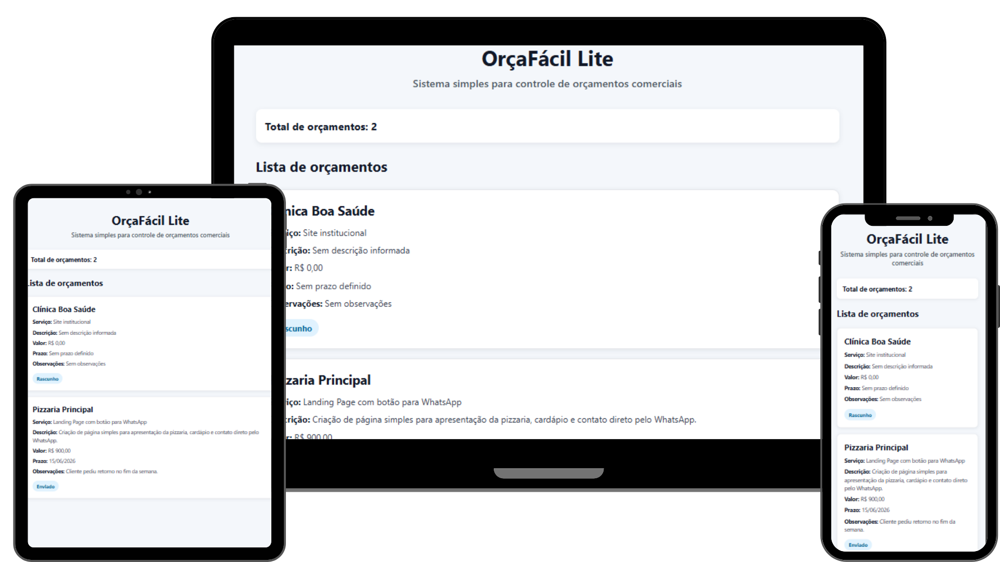

<h1 align="center">OrçaFácil Lite</h1>

<p align="center">
  Aplicação FullStack desenvolvida para cadastrar, organizar e acompanhar orçamentos comerciais de forma simples, utilizando Node.js, Express, PostgreSQL, React.js e Styled-components.
</p>

<p align="center">
  <a href="#-about-the-project">Sobre o projeto</a>&nbsp;&nbsp;|&nbsp;&nbsp;
  <a href="#-features">Funcionalidades</a>&nbsp;&nbsp;|&nbsp;&nbsp;
  <a href="#-technologies">Tecnologias</a>&nbsp;&nbsp;|&nbsp;&nbsp;
  <a href="#-project-structure">Estrutura</a>&nbsp;&nbsp;|&nbsp;&nbsp;
  <a href="#-layout-and-design-decisions">Layout</a>&nbsp;&nbsp;|&nbsp;&nbsp;
  <a href="#-getting-started">Como executar</a>
</p>

<br>

<p align="center">
  
</p>

---

## 🏠 About the project

O **OrçaFácil Lite** é uma aplicação FullStack básica desenvolvida para auxiliar freelancers, desenvolvedores e pequenos prestadores de serviço a organizarem orçamentos comerciais de forma simples.

A proposta do projeto é permitir o cadastro e acompanhamento de propostas enviadas para clientes, armazenando informações como nome do cliente, serviço solicitado, descrição, valor, status, prazo e observações.

Este projeto foi desenvolvido principalmente com foco no reforço dos fundamentos de back-end, incluindo criação de API REST, conexão com banco de dados relacional, modelagem básica de tabela, uso de SQL puro e integração com uma interface em React.js.

O front-end foi construído de forma simples para consumir a API, exibir os dados vindos do PostgreSQL e iniciar a estrutura visual utilizando Styled-components.

---

## 🧰 Features

* API REST criada com Node.js e Express
* Banco de dados PostgreSQL rodando localmente via Docker
* Conexão do back-end com PostgreSQL utilizando o driver `pg`
* Criação da tabela `budgets` com SQL puro
* Listagem de orçamentos cadastrados
* Cadastro de novos orçamentos via API
* Atualização de orçamentos via API
* Exclusão de orçamentos via API
* Validação básica de campos obrigatórios no back-end
* Testes de endpoints com Thunder Client
* Front-end em React.js consumindo dados reais da API
* Renderização dos orçamentos vindos do banco de dados
* Estilização inicial utilizando Styled-components
* Formatação visual de valores monetários e datas
* Estrutura preparada para evolução do CRUD completo pela interface

---

## 💻 Technologies

Este projeto foi desenvolvido com as seguintes tecnologias:

### Front-end

* React.js
* Vite
* JavaScript
* Styled-components
* Fetch API

### Back-end

* Node.js
* Express.js
* PostgreSQL
* SQL puro
* Driver `pg`
* dotenv
* cors
* express.json

### Ferramentas

* Docker
* Thunder Client
* Git
* GitHub
* VS Code
* npm

---

## 👷 Project structure

A estrutura principal do projeto está organizada em duas camadas: front-end e back-end.

```bash
orcafacil-lite/
├── backend/
│   ├── src/
│   │   ├── config/
│   │   │   └── database.js
│   │   ├── controllers/
│   │   │   └── budgets.controller.js
│   │   ├── database/
│   │   │   └── schema.sql
│   │   ├── routes/
│   │   │   └── budgets.routes.js
│   │   └── server.js
│   ├── .env
│   ├── package.json
│   └── package-lock.json
│
├── frontend/
│   ├── src/
│   │   ├── pages/
│   │   │   └── Home/
│   │   │       ├── index.jsx
│   │   │       └── styles.js
│   │   ├── services/
│   │   │   └── budgetService.js
│   │   ├── App.jsx
│   │   └── main.jsx
│   ├── package.json
│   └── package-lock.json
│
├── .gitignore
└── README.md
```

---

## 🏗️ Layout and design decisions

O layout do projeto foi pensado para ser simples, limpo e funcional, priorizando a visualização clara dos orçamentos cadastrados.

A interface utiliza Styled-components para organizar a estilização diretamente no ambiente React, facilitando a separação visual entre estrutura, dados e estilos.

Alguns pontos de destaque no layout:

* interface centralizada e objetiva
* cards individuais para cada orçamento
* hierarquia visual clara entre cliente, serviço, valor e status
* uso de cores suaves para melhorar a leitura
* status destacado visualmente
* formatação de valores em moeda brasileira
* formatação de datas em padrão brasileiro
* estrutura preparada para receber formulário, filtros e ações pela interface

---

## 🔰 Getting Started

### Prerequisites

Antes de começar, você vai precisar ter instalado:

* Git
* Node.js
* npm
* Docker Desktop
* VS Code
* Thunder Client ou ferramenta similar para testes de API

---

### Clone the repository

```bash
git clone https://github.com/seu-usuario/orcafacil-lite.git
```

Acesse a pasta do projeto:

```bash
cd orcafacil-lite
```

---

## ⚙️ Back-end setup

Acesse a pasta do back-end:

```bash
cd backend
```

Instale as dependências:

```bash
npm install
```

Crie um arquivo `.env` dentro da pasta `backend` com as variáveis necessárias:

```env
PORT=3004

DB_HOST=localhost
DB_PORT=5434
DB_USER=orcafacil
DB_PASSWORD=orcafacil123
DB_NAME=orcafacil_db
```

Suba o container PostgreSQL com Docker:

```bash
docker run --name orcafacil-postgres -e POSTGRES_USER=orcafacil -e POSTGRES_PASSWORD=orcafacil123 -e POSTGRES_DB=orcafacil_db -p 5434:5432 -d postgres
```

Acesse o PostgreSQL dentro do container:

```bash
docker exec -it orcafacil-postgres psql -U orcafacil -d orcafacil_db
```

Execute o script SQL disponível em:

```bash
backend/src/database/schema.sql
```

Depois, inicie o servidor:

```bash
npm run dev
```

O back-end estará rodando em:

```bash
http://localhost:3004
```

Rotas principais da API:

```bash
GET    /budgets
POST   /budgets
PATCH  /budgets/:id
DELETE /budgets/:id
```

---

## 🎨 Front-end setup

Em outro terminal, acesse a pasta do front-end:

```bash
cd frontend
```

Instale as dependências:

```bash
npm install
```

Inicie o front-end:

```bash
npm run dev
```

O front-end estará rodando em:

```bash
http://localhost:5175
```

---

## 📌 API endpoints

### Listar orçamentos

```bash
GET /budgets
```

Retorna todos os orçamentos cadastrados no banco de dados.

---

### Criar orçamento

```bash
POST /budgets
```

Exemplo de body:

```json
{
  "client_name": "Pizzaria Principal",
  "service_name": "Landing Page com botão para WhatsApp",
  "description": "Página simples para apresentar a pizzaria, cardápio e contato direto pelo WhatsApp.",
  "price": 900,
  "status": "Enviado",
  "deadline": "2026-06-15",
  "notes": "Cliente pediu retorno no fim da semana."
}
```

---

### Atualizar orçamento

```bash
PATCH /budgets/:id
```

Exemplo de body:

```json
{
  "status": "Aprovado",
  "price": 1200
}
```

---

### Deletar orçamento

```bash
DELETE /budgets/:id
```

Remove um orçamento pelo seu identificador.

---

## 📚 What I learned

Durante o desenvolvimento deste projeto, pratiquei conceitos importantes de desenvolvimento FullStack, principalmente no back-end:

* criação de servidor com Node.js e Express
* configuração de variáveis de ambiente com dotenv
* uso de middlewares como cors e express.json
* conexão do Node.js com PostgreSQL utilizando `pg`
* criação de tabela relacional com SQL puro
* definição de campos obrigatórios, opcionais, valores padrão e timestamps
* construção de API REST com GET, POST, PATCH e DELETE
* uso de parâmetros de rota com `req.params`
* uso de corpo da requisição com `req.body`
* testes de endpoints com Thunder Client
* execução do PostgreSQL localmente com Docker
* integração entre React.js e API própria
* renderização de dados reais vindos do banco de dados
* estilização inicial com Styled-components

---

## 🚀 Next steps

Melhorias planejadas para as próximas versões:

* Criar orçamento diretamente pela interface
* Atualizar status do orçamento pelo front-end
* Excluir orçamento pelo front-end
* Criar filtros por status
* Adicionar cards de resumo
* Melhorar responsividade
* Criar README com imagens reais do projeto
* Adicionar deploy do front-end e back-end futuramente

---

## 👨‍💻 Author

Desenvolvido por Marco Vinícius Menezes Xavier.

[LinkedIn](https://www.linkedin.com/in/seu-linkedin) | [GitHub](https://github.com/seu-usuario)
